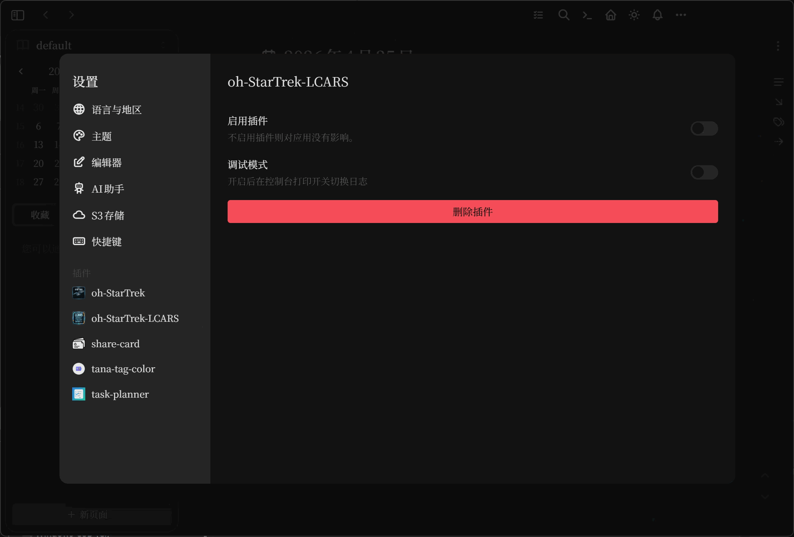
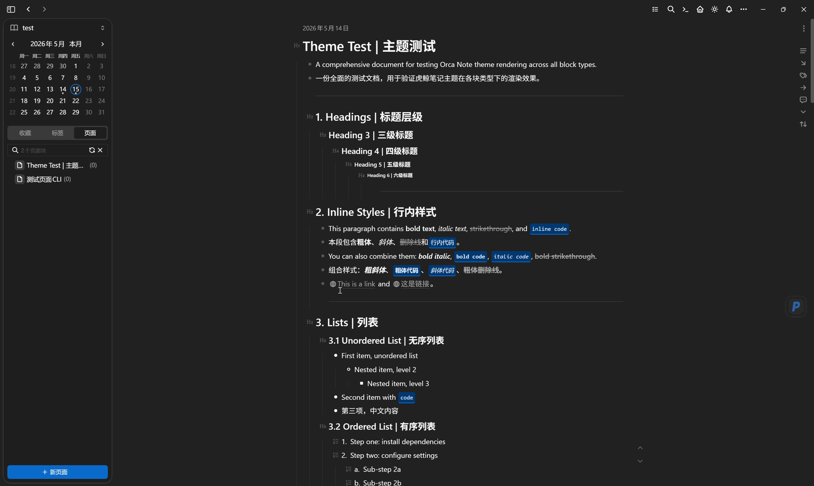
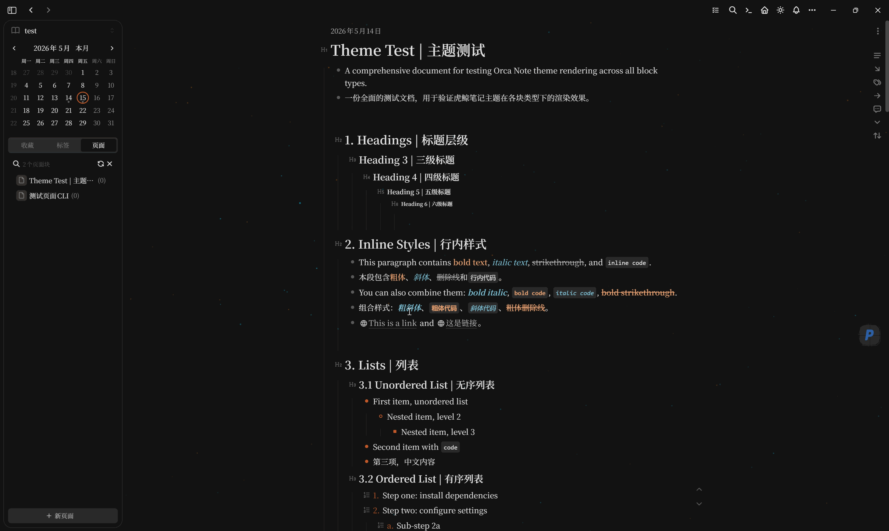

# oh-StarTrek-LCARS

> *"Computer, display user preferences."*  
> *"Preferences pinned to side panel. Ready for quick access."*

让虎鲸笔记（Orca Note）化身星际舰队终端。LCARS 工具箱为你的工作流注入星舰基因——PADD 锁定常用开关，变形场重塑编辑空间。

---

## LCARS 工具箱

oh-StarTrek-LCARS 是星际迷航风格的虎鲸笔记插件套件，以星舰操作界面为灵感，提供高效的工作流增强工具。

### 📌 PADD (Personal Access Display Device)

**星际迷航中的便携访问设备**，船员用它快速访问系统和个人偏好。

在虎鲸笔记中，PADD 将设置面板的开关钉选到编辑器侧边栏：

1. 唤出设置面板（`Ctrl+,`）
2. 点击任意开关旁的 `+` 钉选按钮
3. 从千余图标中择一枚专属标识

自此，该开关便驻守于侧边栏，指尖轻触即刻切换。

**功能开关：** 插件设置面板提供「📱 个人终端 | PADD ► 设置面板钉选 ◄」开关，可一键启用/禁用。关闭后侧边栏钉选图标自动隐藏。

**兼容范围：**
- 虎鲸原生设置（24小时制、拼写检查、自动下载网络图片……）
- 第三方插件布尔开关（oh-StarTrek、tana-tag-color、task-planner 等）

### ✨ 变形场 (Morphic Field)

**星际迷航中形态变换的底层力场**，改变空间的结构与形态。

在虎鲸笔记中，变形场让你拖拽扩展编辑区的宽度——两侧同时收缩，编辑区居中膨胀。

搭配 oh-StarTrek 主题使用时，星空会与变形场联动——拖拽时指示线两侧的星星受引力牵引，拖着流光尾迹向你手中汇聚；松手后星星缓缓归位，光芒渐熄，仿佛星舰在曲速航行中微调航线。

**使用方式：**
1. 在插件设置面板开启「✨ 变形场 | Morphic Field ► 编辑区域宽度调整 ◄」
2. 编辑区两侧出现隐形手柄，鼠标悬停时指示线浮现
3. 拖拽手柄展宽编辑区，双击手柄恢复原始宽度

---

## 安装指南

将插件文件夹置于虎鲸笔记插件目录，重启应用即生效。

---

## 版本记录

**v1.1.0** — 变形场
- ✨ 变形场：拖拽扩展编辑区宽度，星星引力牵引与流光拖尾
- ✨ 手柄指示线视觉增强：橙色渐变线体 + 蓝色外发光
- 📌 PADD / 变形场功能命名星际迷航设定化
- ⚡ 拖拽性能优化：RAF 节流 + 跳过布局计算
- 🐛 多面板独立原始值，修复双面板宽度不一致

**v1.0.1** — 功能完善
- 🐛 PADD 开关切换响应优化
- 🐛 首次加载默认值初始化

**v1.0.0** — 初始发布  
- 📌 PADD 设置钉选工具
- 🎨 1000+ Tabler Icons 图标选择器
- ⚡ PADD 功能开关（可动态启用/禁用）
- 🔧 调试模式

---

## 🔗 相关项目

- 🖖 **oh-StarTrek 主题** — [github.com/XxKARLxX/oh-StarTrek](https://github.com/XxKARLxX/oh-StarTrek)  
  星际迷航风格虎鲸笔记主题，星空画布 + 跃迁动画 + 变形场联动

- 🐋 **虎鲸笔记** — [github.com/sethyuan/orca-note](https://github.com/sethyuan/orca-note)  
  Orca Note 官方仓库

- 📚 **Awesome OrcaNote** — [github.com/sethyuan/awesome-orcanote](https://github.com/sethyuan/awesome-orcanote)  
  虎鲸笔记插件与资源合集

---

*"Setting course for productivity. Engage."*
